  

  
  
  

  

## 👋 About Me

I am **Abdullah Ragab**, a Software Engineering student and full-stack developer focused on building practical, production-ready digital products. 

I work across web platforms, Arabic RTL dashboards, automation tools, Telegram bots, AI-assisted workflows, and VPS-deployed systems. My focus is not just writing code, but shipping usable software: clear interfaces, structured backends, reliable deployment, and real business value.

## 🚀 Main Focus

<table align="center">
  <tr>
    <td width="50%" valign="top">
      <h3>💻 Full-Stack Systems</h3>
      
Next.js, React, TypeScript, Node.js, Prisma, PostgreSQL, REST APIs, dashboards, admin panels, business platforms.

    </td>
    <td width="50%" valign="top">
      <h3>🤖 AI & Automation</h3>
      
AI-agent workflows, prompt systems, automation tools, Telegram bots, repo analysis, local-first productivity tools.

    </td>
  </tr>
  <tr>
    <td width="50%" valign="top">
      <h3>🌍 Arabic-first Products</h3>
      
RTL interfaces, Arabic dashboards, ERP-style systems, legal-tech tools, business management platforms.

    </td>
    <td width="50%" valign="top">
      <h3>⚙️ Deployment & Infrastructure</h3>
      
Linux VPS, Nginx, PM2, PostgreSQL, Cloudflare, Docker, production releases, server monitoring.

    </td>
  </tr>
</table>

## 🛠️ Tech Stack

  

## 📂 Selected Projects

<table align="center">
  <tr>
    <td width="50%" valign="top">
      <h3>RepoRadar AI</h3>
      
Local developer tool for scanning repositories and generating project intelligence reports, README suggestions, fix plans, portfolio summaries, and AI-agent prompts.

      
<i>Developer Tools • Repo Analysis • AI Workflows</i>

    </td>
    <td width="50%" valign="top">
      <h3>Abud Shorts Engine</h3>
      
Local-first video generation engine using templates, TTS, captions, Pexels footage, Remotion rendering, and a React interface.

      
<i>Automation • Video Tools • Creator Systems</i>

    </td>
  </tr>
  <tr>
    <td width="50%" valign="top">
      <h3>Mohamy Phone</h3>
      
Android legal-office management app for lawyers to manage cases, clients, sessions, tasks, files, and templates with local-first architecture.

      
<i>Legal Tech • Kotlin • Offline-first</i>

    </td>
    <td width="50%" valign="top">
      <h3>ABUD Platform</h3>
      
Personal platform for presenting services, projects, blog content, quote requests, and digital product work.

      
<i>Portfolio • Business Website • Admin Structure</i>

    </td>
  </tr>
  <tr>
    <td width="50%" valign="top">
      <h3>ERP System</h3>
      
Arabic ERP-style system for managing operations, sales, customers, inventory, invoices, reports, and dashboards.

      
<i>Business Systems • Arabic RTL UI • Operations Management</i>

    </td>
    <td width="50%" valign="top">
      <h3>VPS Monitor Bot</h3>
      
Telegram-based monitoring assistant for tracking VPS CPU, RAM, disk usage, and alerts.

      
<i>Infrastructure Monitoring • Automation • Server Visibility</i>

    </td>
  </tr>
  <tr>
    <td width="50%" valign="top">
      <h3>PromptForge</h3>
      
Prompt-engineering platform for drafting, storing, improving, and reusing prompt templates for LLM workflows.

      
<i>AI Productivity • Prompt Systems • Reusable Workflows</i>

    </td>
    <td width="50%" valign="top">
      <!-- Empty cell for grid balance -->
    </td>
  </tr>
</table>

## 📊 GitHub Analytics

  
  

  

## 💼 Practical Background

* Built and worked on real-world websites, systems, bots, and automation tools
* Experience with full-stack development, dashboards, databases, and deployment
* Background in freelancing, e-commerce, content, marketing, and digital operations
* Focused on portfolio-ready products with practical business value

---

  <b>Building practical software from idea to deployment.</b>

